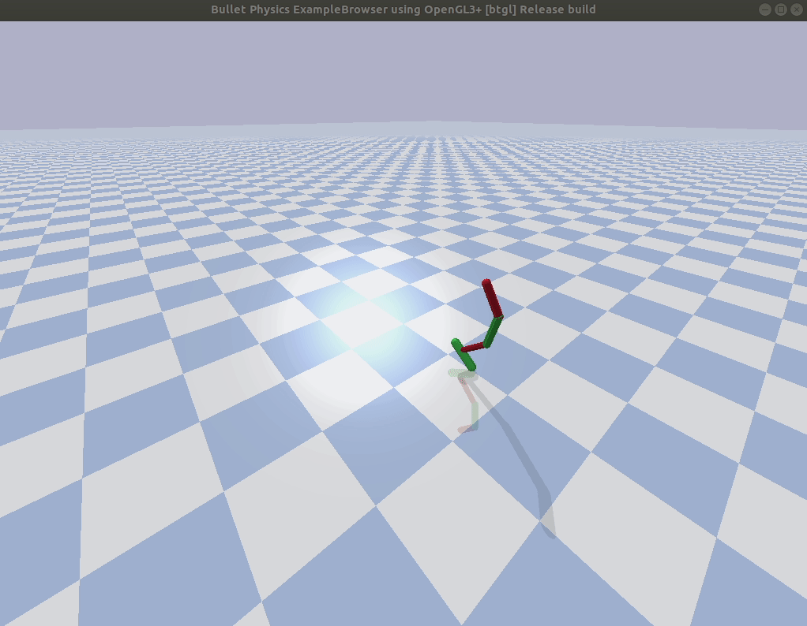
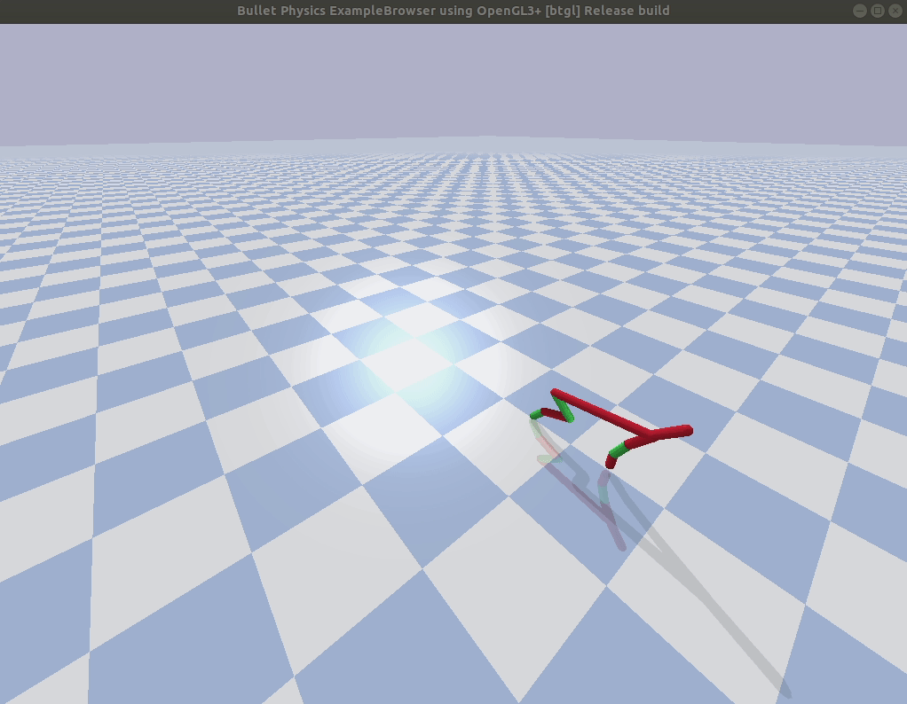
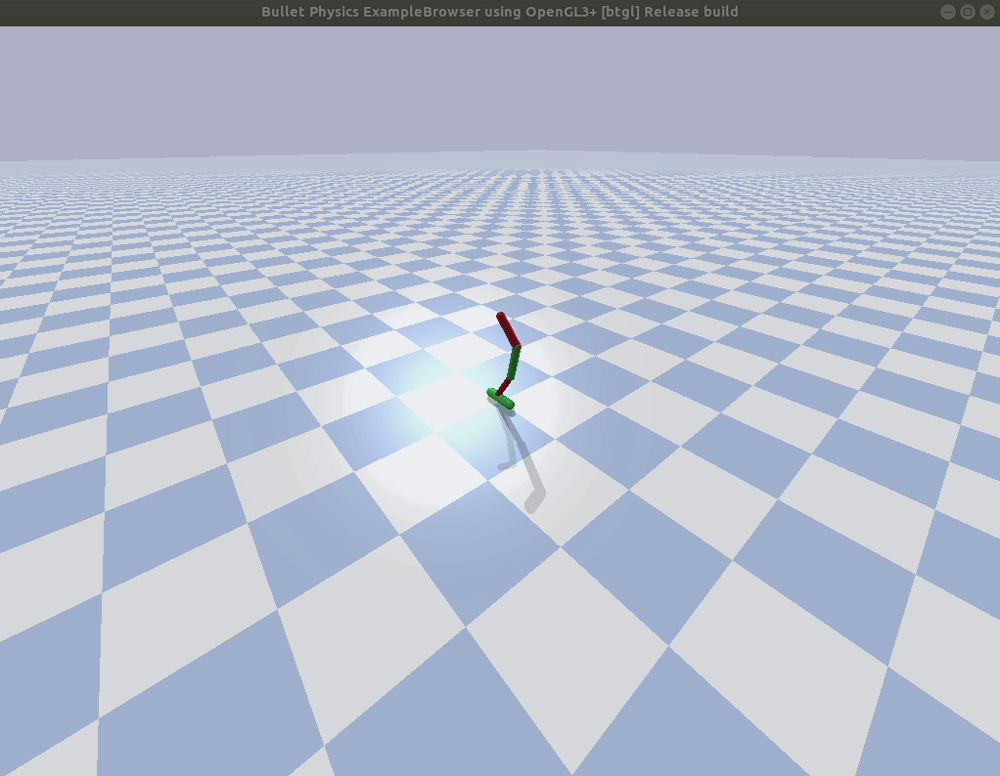
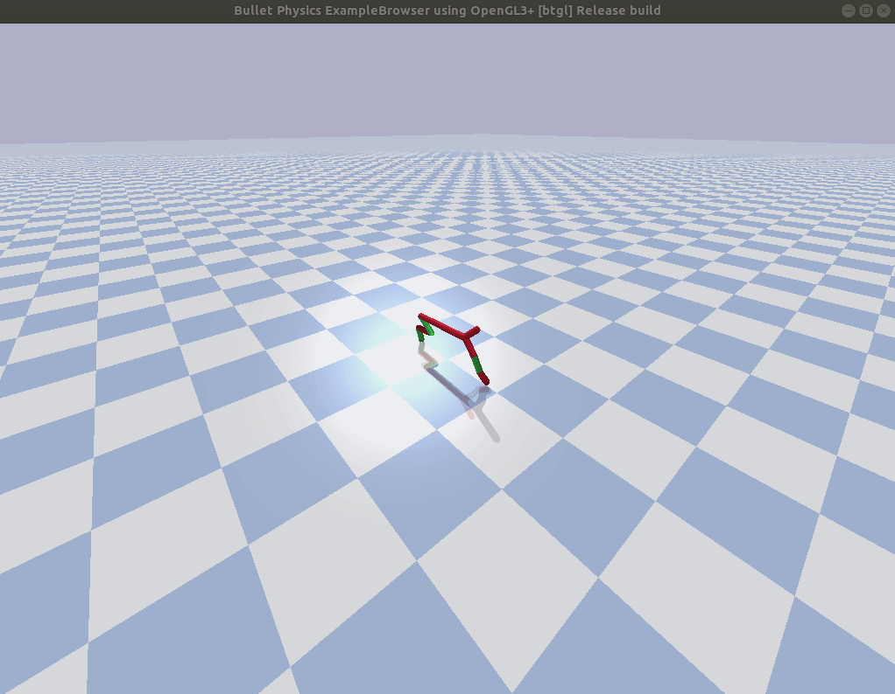
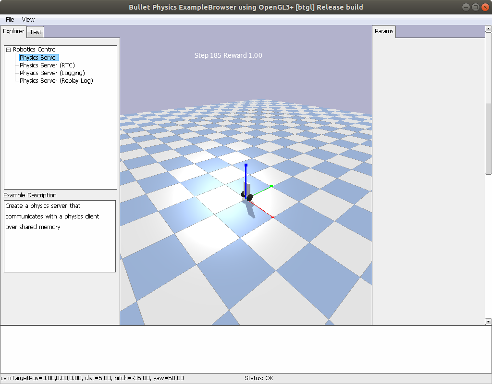
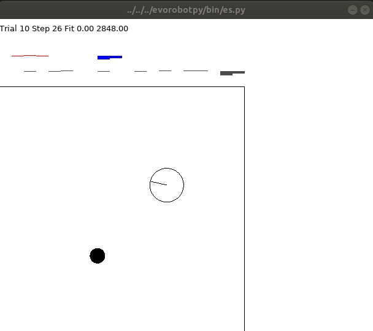

# Behavioural and Cognitive Robotics (exercises)

## Exercise 1

You can find the implementation in the folder 'exercise_1'


## Exercise 2

### a)

Simple neural network controller for my Gym problem (CartPole-v0) was implemented in '/exercise_1/exercise_2a.py'. At the end of each episode the program prints the total reward calculated as the sum of the rewards for all steps. Since the parameters of the neural networks controller do not change within the episodes, the agent will not be able to balance the pole for many steps.

### b)

The evolutionary strategy for the neural network controller was implemented in '/exercise_1/exercise_2b.py'. I took the size of the population equal to 10 and randomly initialized weights for each neural network using normal distribution with average 0 and variance 0.1. Biases were set equal to 0.

The program is separated in two parts: the training part and the post-evaluation one. During the first part the evolutionary strategy tries to find appropriate neural network controller. During the second stage the program chooses the best neural network from the population and render the solution for the same number of episodes to show the robustness of the controller. 

I set the number of episodes equal to 10 with 200 steps in each. Proposed method can solve the task, but  that does not happen every time I run the program, because that depends on the initial parameters (weights) of the neural networks in the population. If we increase the number of episodes or the size of the population, we will obtain better neural network by the end of the training process. 

For that particular task 5 hidden neurons are enough while the increase of this parameter will not improve performance in general case but can slow down the search of the suitable neural network. The increase of the variance of the perturbation vector can affect the search in the same way.

The implemented algorithm can be applied to the 'Pendulum-v0' task (we just need to change the name of the environment in the sourse code), but in my case it did not provide good results. The program does not manage to hold the pendulum in desired position for a long period of time.


## Exercise 3

I run few replications of the experiment with different seed values (11, 23, 35) using pre-prepared 'acrobot.ini' configuration file. 

I found in the source code that the action vector is either +1, 0 or -1 torque on the joint between the two pendulum links. The state consists of the sin() and cos() of two rotational joint angles and the joint angular velocities : [cos(theta1) sin(theta1) cos(theta2) sin(theta2) thetaDot1 thetaDot2].

You can see the perfomance across generations in the following figure:


I was able to observe the behavior of evolved robot with the python script 'es.py' with the flag '-t'. You can see one frame of the simulation below:


## Exercise 4

To replace the original reward function with the revised one I identified the pybullet folder that contains the files 'gym_locomotion.py' and 'robot_locomotors.py'. On my computer it has a path:
```bash
/usr/local/lib/python3.6/dist-packages/pybullet_envs/
```

I evolved the halfcheetah and hopper robots with the original files using the seed 24. After that I overwrote the original reward function files with the revised one contained in the 'evorobotpy/pybullet' and I evolved robots again with the seed 23.

I ran the simulation of the results with the graphical rendering and I figured out that the robots evolved with the help of the original reward function were not able to move to the target. The hopper robot was only able to stand at the original point.



The halfcheetah tried to move but crashed with every attempt.



At the same time the robots evolved with the help of the revised reward function were able to move in the desired direction.





The original reward function consists of five main parts. To estimate if the robot behaves in 'good' or 'bad' way we need to: check if the robot is 'alive' or in other words check if the robot is high enough above the ground and does not fall; look at the robot 'progress' - check if the robot moves to the target or in opposite direction; estimate the 'electricity_cost', or the cost of the motor using; check if the joints of the robot stuck somewhere using the 'joints_at_limit_cost' term and, finally, make sure that the robot avoids collisions with the help of the 'feet_collision_cost'. The total reward function is calculated as the sum of those parts.

The revised reward function was changed for each robot in its own way. The main point here is that it became simpler than the original one.

For example, for the hopper robot instead of calculating the reward function as the sum of all five criteria we estimate only the 'progress' of that robot and do not count other terms.

For the halfcheetah robot the alive bonus was changed a bit - the robot got new termination condition which checks the height of the robot with respect to the ground (z < 0.3). So, if the robot is lower than the threshold level, we should not continue this particular experiment and we definitely should not encourage such behaviour. And again, the total reward function was simplified - for now we calculate it as the sum of the 'progress' and 'joints_at_limit_cost' terms.

Thus, I can say that the modified reward functions in the provided files are better for the evoloutionary strategies because they are simpler. They only encourage our robots to move to the target and try to prevent falls and stucks (as the halfcheetah reward function). They do not care about additional terms like electricity cost.


## Exercise 5

I implement the balance-bot using the instructions from the .pdf file and evolve the robot using 'es.py' script with the seeds 23 and 24. The robot has learned to steadily balance at one place.




## Exercise 6

I compiled and installed the source code with the provided commands:

```bash
python3 setupErDiscrim.py build_ext --inplace
cp ErDiscrim*.so ../bin # or cp ErDiscrim*.dll ../bin
```

I ran 12 experiments (seeds 23-34) using the LSTM architecture and 4 experiments (seeds 35-38) using the feed-forward neural network.

For the LSMT architecture I got three main families:

* Robot moves forward until it finds the cylinder, after that it moves to that one and stops near it.


* Robot moves until it finds the cylinder, after that it moves and remains near that one, but does not stops completely.


* Robot moves backward in a very strange manner and when it collides with a cylinder, it stops and turns in the direction of the latter.

