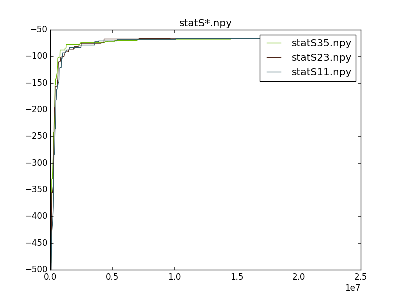

# Behavioural and Cognitive Robotics (exercises)

## Exercise 1

You can find the implementation in the folder 'exercise_1'

## Exercise 2

### a)

Simple neural network controller for my Gym problem (CartPole-v0) was implemented in '/exercise_1/exercise_2a.py'. At the end of each episode the program prints the total reward calculated as the sum of the rewards for all steps. Since the parameters of the neural networks controller do not change within the episodes, the agent will not be able to balance the pole for many steps.

### b)

The evolutionary strategy for the neural network controller was implemented in '/exercise_1/exercise_2b.py'. I took the size of the population equal to 10 and randomly initialized weights for each neural network using normal distribution with average 0 and variance 0.1. Biases were set equal to 0.

The program is separated in two parts: the training part and the post-evaluation one. During the first part the evolutionary strategy tries to find appropriate neural network controller. During the second stage the program chooses the best neural network from the population and render the solution for the same number of episodes to show the robustness of the controller. 

I set the number of episodes equal to 10 with 200 steps in each. Proposed method can solve the task, but  that does not happen every time I run the program, because that depends on the initial parameters (weights) of the neural networks in the population. If we increase the number of episodes or the size of the population, we will obtain better neural network by the end of the training process. 

For that particular task 5 hidden neurons are enough while the increase of this parameter will not improve performance in general case but can slow down the search of the suitable neural network. The increase of the variance of the perturbation vector can affect the search in the same way.

The implemented algorithm can be applied to the 'Pendulum-v0' task (we just need to change the name of the environment in the sourse code), but in my case it did not provide good results. The program does not manage to hold the pendulum in desired position for a long period of time.

## Exercise 3

I run few replications of the experiment with different seed values (11, 23, 35) using pre-prepared 'acrobot.ini' configuration file. 

I found in the source code that the action vector is either +1, 0 or -1 torque on the joint between the two pendulum links. The state consists of the sin() and cos() of two rotational joint angles and the joint angular velocities : [cos(theta1) sin(theta1) cos(theta2) sin(theta2) thetaDot1 thetaDot2].

You can see the perfomance across generations in the following figure:

I was able to observe the behavior of evolved robot with the python script 'es.py' with the flag '-t'. You can see one frame of the simulation below:

